# UAE Used Car Market Analysis

A full end-to-end data analytics project built on self-scraped listings from three UAE car marketplaces — CarSwitch, AutoTraders.ae, and OpenSooq — combined into a single 28,109-listing dataset, cleaned, explored, and modeled to answer real questions about how the UAE used car market actually behaves.

Every number in this README comes from an actual run of the notebooks in this repo. Where something turned out messier than expected, it's left in rather than smoothed over — a few of the more useful findings here came directly from things going wrong first.

## Table of Contents

- [Why This Project](#why-this-project)
- [The Dataset](#the-dataset)
- [The Pipeline](#the-pipeline)
  - [1. Scraping](#1-scraping)
  - [2. Cleaning](#2-cleaning)
  - [3. Exploratory Analysis](#3-exploratory-analysis)
  - [4. Modeling and Analysis](#4-modeling-and-analysis)
- [Key Takeaways](#key-takeaways)
- [Tech Stack](#tech-stack)
- [Project Structure](#project-structure)
- [Skills Demonstrated](#skills-demonstrated)
- [Running This Yourself](#running-this-yourself)
- [Known Limitations](#known-limitations)
- [Possible Next Steps](#possible-next-steps)

---

## Why This Project

Built as a portfolio piece while job-hunting for data analyst roles in Dubai, on top of a SQL/Power BI/Excel background and a Google Data Analytics certificate — and used as a chance to get properly comfortable with Python and pandas on a real, messy, multi-source dataset rather than a cleaned-up download.

---

## The Dataset

### Sources used

| Source | Listings | Notes |
|---|---|---|
| CarSwitch | 2,357 | Certified/inspected marketplace |
| AutoTraders.ae | ~17,500 | Dealer-heavy, skews toward Premium/Luxury |
| OpenSooq | ~9,200 | Mixed private-seller and dealer classifieds |
| **Combined, after deduplication** | **28,109** | |

### Sources excluded

| Source | Why |
|---|---|
| Dubizzle | Blocked by an Imperva WAF — no plain request or Selenium got through |
| YallaMotor | Cloudflare bot challenge on every listing page |
| DubiCars | Open at first, then started throwing a Cloudflare challenge partway through the project |
| Hatla2ee | `robots.txt` disallows the search path; UAE inventory was also tiny (~400 listings) |
| Kavak | Listings load via a client-side API call rather than server-rendered HTML — not pursued given the other three sources already gave enough volume |

**Rule followed throughout:** if a site puts up active bot detection, it's off the list. No browser automation to defeat a CAPTCHA, no fingerprint spoofing, no working around a WAF — just plain requests to whatever would actually answer them honestly.

---

## The Pipeline

### 1. Scraping

*Notebook: `01_scraping.ipynb` · Code: `src/extractors/`*

Each site needed a different approach:

- **CarSwitch** embeds listings as JSON-LD structured data right in the page — no HTML parsing needed. Rate limiting (HTTP 202s after ~18-20 pages) was handled with a batch-and-resume pattern: 18 pages per batch, fresh session each time, 10-minute cooldown between batches.
- **AutoTraders.ae** is server-rendered HTML (`div.car-card` per listing). The first several scrape attempts came back empty, which looked like a bot wall or a JS-only app — turned out to be a self-inflicted bug: an `Accept-Encoding: br` header sent without Brotli decompression support installed, silently corrupting every response. Dropping Brotli from the headers fixed it instantly.
- **OpenSooq** runs on Next.js, with listings buried inside a `<script id="__NEXT_DATA__">` JSON blob. An early "recursively find the biggest array of dicts" approach grabbed the wrong array twice before dumping the raw JSON and reading it directly found the real path in under a minute: `props.pageProps.serpApiResponse.listings.items`.

A fuzzy-match dedup step (`src/dedup.py`) then runs across all three sources — a hash of brand, model, year, and price/mileage rounded to the nearest thousand. Removed 930 duplicates out of 29,039 combined raw rows (3.2%), lower overlap than expected, suggesting the three sources pull from largely different pools of actual inventory.

### 2. Cleaning

*Notebook: `02_cleaning.ipynb` · Code: `src/finalize_dataset.py`*

- **Brand normalization** — merged spelling/casing splits across sites (`Mercedes-Benz` / `Mercedes Benz` / `Mercedes`, `MINI` / `Mini`, and half a dozen more).
- **"Range Rover" isn't a brand** — a chunk of AutoTraders.ae listings had written it into the brand field. Reassigned to `Land Rover`, folded into the model name.
- **Model name casing** — same problem one level down (`KICKS` vs `Kicks`), fixed with a data-driven rule: for each `(brand, lowercased model)` pair, use whichever casing shows up most often.
- **"Brand new" listings with no mileage** — imputed to 0 km, only where the title explicitly said so.
- **Outlier flagging, not silent dropping** — 42 near-zero-price rows and 11 million-kilometer-mileage rows, both traced to specific AutoTraders.ae template variants (~0.2% of that source). Flagged and excluded from price/mileage math, kept for composition analysis.
- **187 brands classified** into four segments (Mass-market / Mid-range / Premium / Luxury), built fresh for the combined dataset — zero left unmapped.
- **City name standardization**, including OpenSooq's own `"Um Al Quwain"` spelling variant.

### 3. Exploratory Analysis

*Notebook: `03_eda.ipynb`*

Eleven charts, using a single blue gradient throughout — the deepest navy marks the highest value in any ranking or category, lightening as values fall.

**Chart 1 — Price Distribution**

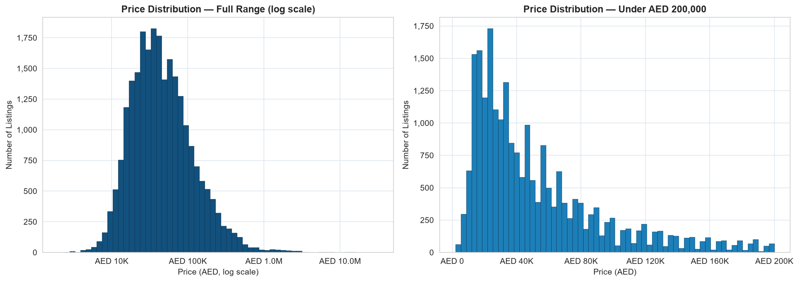

Needed a log-scale x-axis to be readable at all — a straight linear histogram was dominated by one giant bar near zero once genuine multi-million-AED exotic listings entered the mix via AutoTraders.ae. On the log scale it's a clean, roughly log-normal shape, no weird breaks that would suggest leftover bad data.

**Chart 2 — Median Price by Brand**

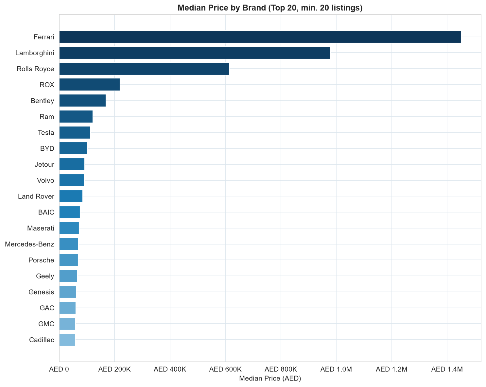

Ferrari, Lamborghini, and Rolls-Royce top the list, unsurprising once real exotic-dealer inventory was in the dataset. ROX (a newer UAE-based EV brand) landing 4th, ahead of Land Rover and Porsche, was surprising enough that it's worth a manual check on those specific listings before repeating the number anywhere.

**Chart 3 — Median Price by Emirate**

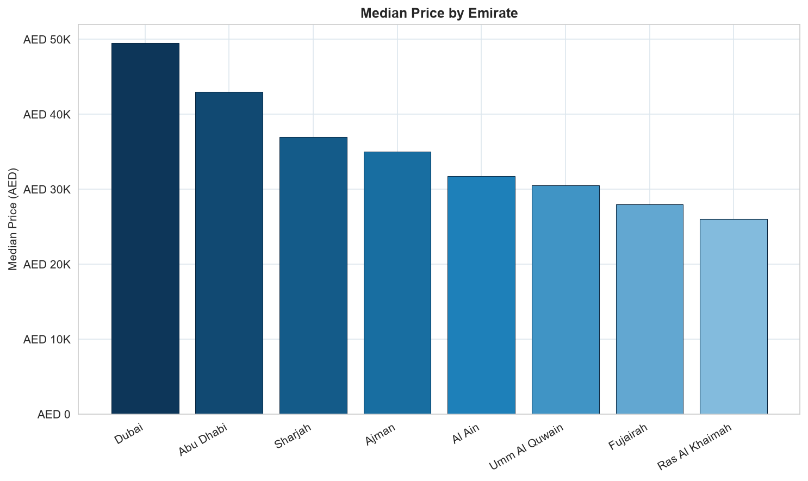

A clean gradient from Dubai down to Ras Al Khaimah, tracking roughly with each emirate's general cost of living.

**Chart 4 — Price Distribution by Emirate**

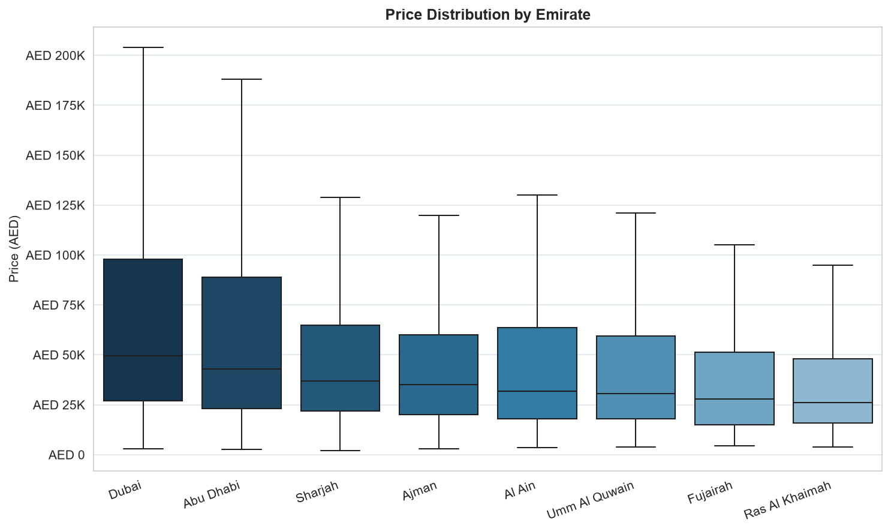

The boxes overlap far more than Chart 3's bar heights suggest — Sharjah through Ras Al Khaimah sit almost on top of each other. That overlap is the tell that emirate-level price differences aren't really a location premium (Chart 5, next, explains what's actually driving it).

**Chart 5 — Brand Segment Composition by Emirate**

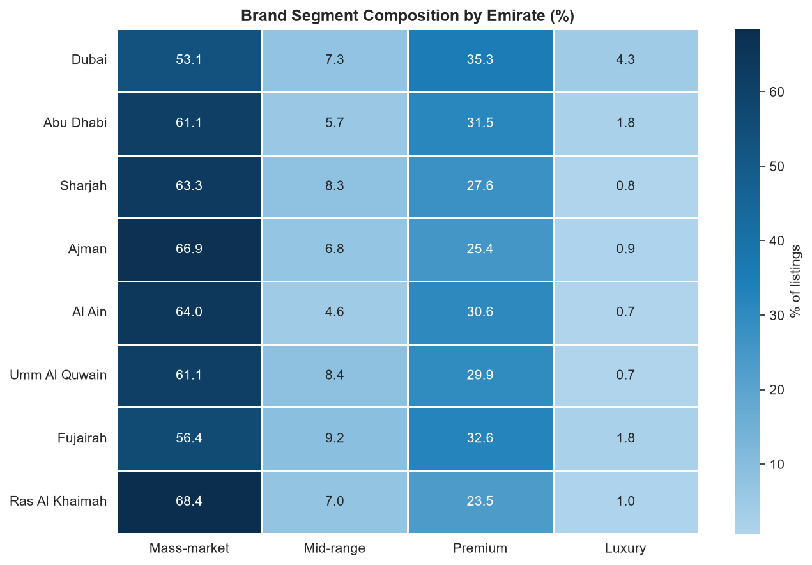

This is the chart that actually explains the overlap in Chart 4, which is why it sits right after it. Dubai has both the lowest Mass-market share and the highest Luxury share of any emirate; Ras Al Khaimah sits at the opposite end. It's not that a car costs more just for being listed in Dubai — Dubai's overall mix of what's for sale skews more expensive to begin with.

**Chart 6 — Depreciation Curves by Brand Segment**

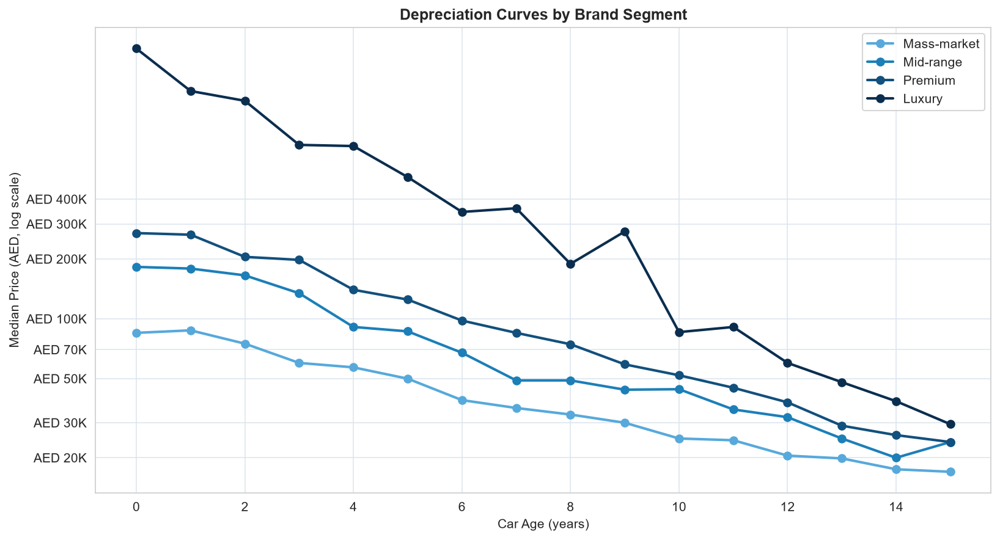

Luxury drops fastest early on, which tracks with new-car pricing generally. The more interesting bit is at the far right: Mid-range actually dips below Mass-market by year 14-15 — older mainstream American and European cars seem to lose value harder in their final years than economy Japanese and Korean cars at the same age.

**Chart 7 — Value Retention by Model**

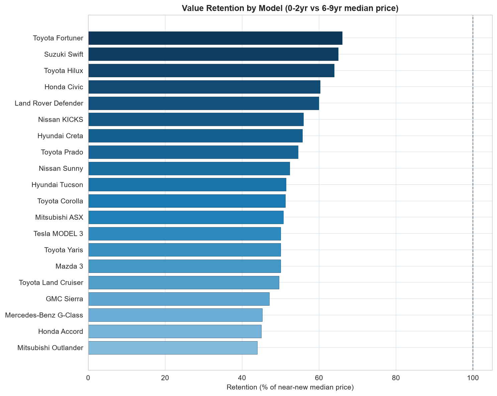

Toyota Fortuner tops the list, with the Suzuki Swift and Hilux close behind. What stood out: the Land Cruiser sits only mid-pack despite its usual reputation as the GCC benchmark, and the Mercedes G-Class shows up near the bottom — likely a recent near-new price spike distorting the ratio rather than the car genuinely losing value faster.

**Chart 8 — Price Tier Composition by Car Age**

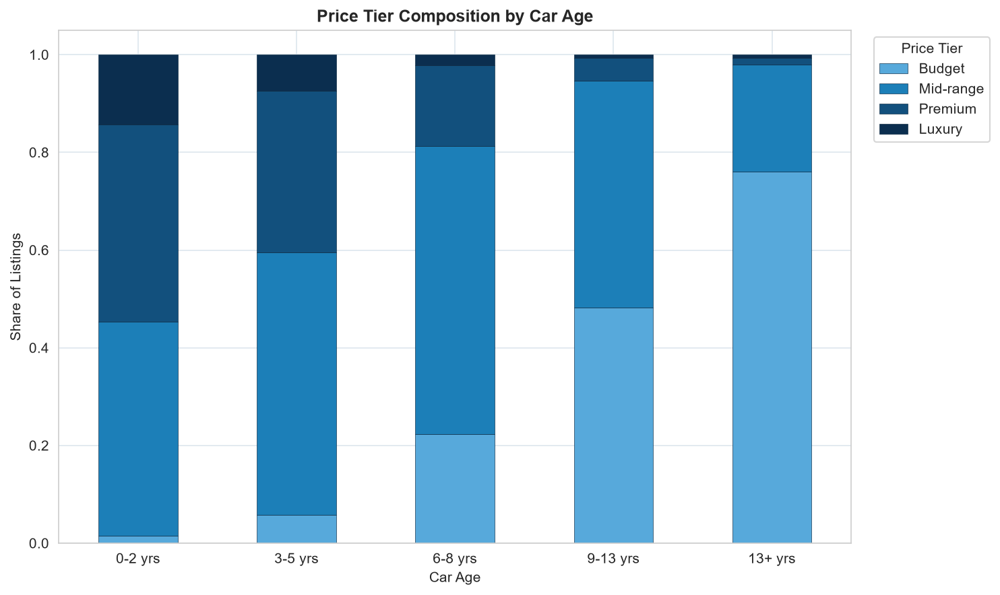

About as textbook as this kind of chart gets — Budget is almost nonexistent among 0-2 year old cars and dominates everything by 13+ years. Depreciation working exactly the way you'd expect.

**Chart 9 — Annual Mileage by Brand Segment**

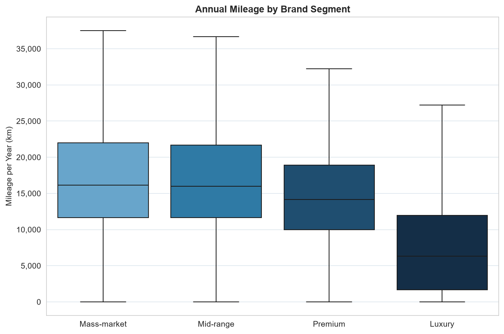

Mass-market and Mid-range track closely, Premium drops off a bit, and Luxury sits in a different world entirely — noticeably lower annual mileage than the other three, fitting the idea that expensive cars here tend to be lease or status vehicles rather than daily drivers.

**Chart 10 — Price Distribution by Source**

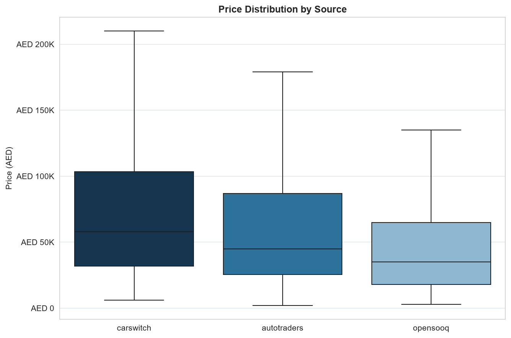

This one didn't go the way I expected. AutoTraders.ae is where the exotic dealer inventory kept turning up while scraping, so I'd have guessed it would show the highest median — instead CarSwitch comes out on top. Tested properly in the analysis notebook rather than left as a guess.

**Chart 11 — Brand Segment Composition by Source**

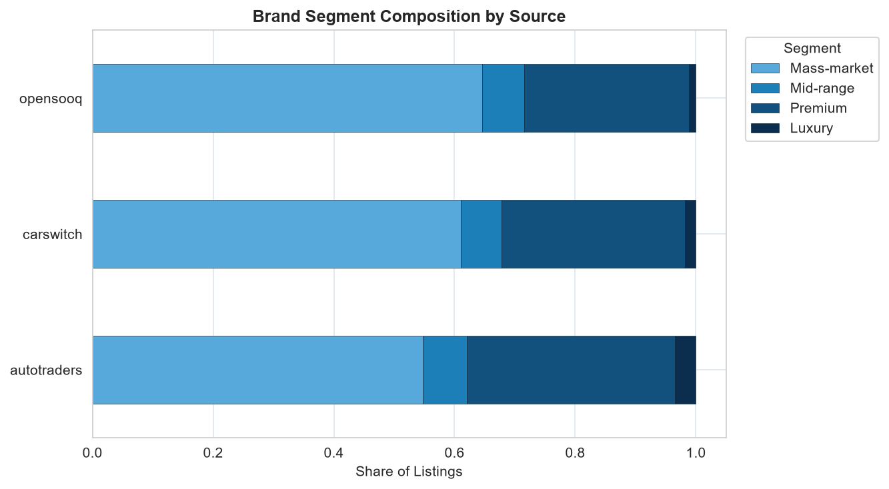

This squares Chart 10 with what browsing the listings actually felt like — AutoTraders.ae genuinely does carry the largest Premium-plus-Luxury share of the three. Composition and median price just aren't the same thing: OpenSooq's mix leans hardest toward Mass-market, and CarSwitch's certified-marketplace pricing apparently outweighs its segment mix. Both true at once.


### 4. Modeling and Analysis

*Notebook: `04_analysis.ipynb`*

Three regression models, evaluated with an honest 80/20 train/test split:

| Model | Features | R² | MAE |
|---|---|---|---|
| Model 1 | mileage + car age + brand segment | 0.091 | AED 63,719 |
| Model 2 | mileage + car age + specific model | 0.213 | AED 44,342 |
| Model 3 | Model 2 + listing source | 0.222 | AED 44,718 |

Model 1's low R² traced back to the Luxury segment containing both genuine hypercars and low-volume classic brands (Studebaker, Borgward, DeLorean) that list for far less than a modern BMW — a four-bucket segment just isn't fine-grained enough for a market this varied. Model 2 roughly doubled R² once it knew the specific make and model instead.

**Model 3 settled an open question.** Adding `source` as a feature found CarSwitch pricing *lower* than AutoTraders.ae (~AED 29,861 lower, holding model/mileage/age constant) — the opposite of what the raw median implied. The real story is a selection effect: CarSwitch's higher raw median comes from *which* cars end up listed there, not from charging more for the same car.

**The value-score system** (flagging listings priced below what the model expects) went through a real debugging arc:

1. Fit on raw price, it predicted negative prices for old high-mileage cars and flagged an implausible 65.8% of listings as "underpriced" — a sign of miscalibration, not a real signal.
2. Refitting on **log(price)** fixed the negative-prediction problem and brought the flagged share to 53.3%, but the gap between a sane median (+3.65%) and a wild mean (-39.6%) meant outliers were still distorting things.
3. The outliers turned out to be genuine classic/collector cars (a 1974 Corvette, several Nissan Skylines including a likely R34 GT-R at AED 2.95M) — a linear age term assumes price declines forever, which doesn't hold for cars old enough to be collectible again.
4. Excluding cars over 25 years old plus the Nissan Skyline nameplate specifically brought the standard deviation down from 480 to 137.
5. What remained was two different problems: Rolls-Royce Cullinan and Porsche 911 Carrera listings priced correctly but poorly predicted (too few comparable listings at that price tier), and a handful of likely data-entry errors. At that point, chasing individual cases further stopped being productive — documented as a known limitation instead, with `value_gap_aed` kept as the more trustworthy ranking metric.

---

## Key Takeaways

The market-level findings this project surfaced, stated plainly:

1. **Emirate price gaps are a composition effect, not a location premium.** Dubai's higher median price isn't the same car costing more in Dubai — it's that Dubai's inventory skews toward Premium and Luxury segments in the first place. Controlling for what's actually being sold, the "expensive emirate" story mostly dissolves (Charts 4–5, confirmed by the regression).

2. **Where a car is listed moves its price independent of the car itself.** Holding make, model, mileage, and age constant, the same car lists roughly AED 29,861 *lower* on CarSwitch than on AutoTraders.ae — the opposite of what raw medians imply. Platform choice is a real, measurable pricing factor for buyers and sellers, not just a venue.

3. **Value retention is model-specific, and reputation doesn't always match the data.** Toyota Fortuner, Suzuki Swift, and Hilux retain value best; the Land Cruiser lands only mid-pack despite its GCC benchmark reputation. For anyone buying to resell, the nameplate-level retention ranking is more actionable than segment-level generalisations.

4. **Luxury cars are driven far less — they behave like status/lease assets.** Annual mileage for the Luxury segment sits in a different band entirely from the other three, consistent with these being second cars, leases, or collector pieces rather than daily drivers. That also distorts naive depreciation models, which assume price falls with age indefinitely.

5. **Pricing is only weakly predictable from headline features alone (R² ≈ 0.22).** Make, model, mileage, and age explain a modest share of price variance; the rest lives in trim, condition, spec, and seller type. A practical takeaway for any pricing tool: model *specific* make-and-model, not broad segments, and expect meaningful residual uncertainty at the top of the market where comparable listings are thin.

---

## Tech Stack

| Category | Tools |
|---|---|
| Language | Python 3.12 |
| Scraping | `requests`, `beautifulsoup4` |
| Data handling | `pandas`, `numpy` |
| Modeling | `scikit-learn` |
| Visualization | `matplotlib`, `seaborn` |
| Environment | `venv`, Jupyter (`jupyter`, `notebook`, `ipykernel`) in VS Code |

No scraping frameworks beyond `requests` + `beautifulsoup4` — kept deliberately lightweight, since none of the three final sources needed a headless browser once each site's actual structure was worked out.

---

## Project Structure

```
carswitch-uae-cars/
├── data/
│   ├── raw/                          # per-source scraped output
│   └── processed/                    # deduplicated, cleaned, and final datasets + chart PNGs
├── notebooks/
│   ├── 01_scraping.ipynb
│   ├── 02_cleaning.ipynb
│   ├── 03_eda.ipynb
│   └── 04_analysis.ipynb
├── scraper/
│   ├── common.py                     # shared request/parsing/cleaning helpers
│   ├── recon.py                      # site-structure reconnaissance tool
│   ├── dump_raw.py                   # raw-response diagnostic tool
│   ├── diagnostic_report.py          # dataset health-check report generator
│   ├── inspect_outliers.py           # outlier row inspection tool
│   ├── dedup.py                      # cross-source fuzzy deduplication
│   ├── finalize_dataset.py           # brand/model normalization + feature engineering
│   └── extractors/
│       ├── autotraders.py
│       └── opensooq.py
├── requirements.txt
└── README.md
```

---

## Skills Demonstrated

- **Multi-source web scraping** — reading and respecting `robots.txt`/bot-protection signals rather than working around them, adapting strategy per site (JSON-LD, embedded Next.js JSON, server-rendered HTML)
- **Debugging under uncertainty** — the Brotli header bug and the OpenSooq JSON-path hunt both required diagnosing a problem with limited visibility into the actual server response
- **Data cleaning at scale across inconsistent sources** — normalization, fuzzy deduplication, outlier detection that digs into root cause rather than applying a blind threshold
- **Feature engineering grounded in domain reasoning** — why a 25-year age cutoff, why exclude a specific nameplate, why log-transform the regression target
- **Exploratory visualization** with a consistent, intentional design language
- **Regression modeling and honest evaluation** — proper train/test splitting, treating a low R² as something to explain rather than hide
- **Hypothesis testing over impression** — the CarSwitch/AutoTraders.ae pricing question started as a chart-level guess, resolved with an actual controlled comparison
- **Critical self-review of model output** — recognizing when a "result" (65.8% underpriced) is a sign the model is wrong, not a finding
- **Knowing when to stop** — the value-score debugging arc ends with a documented limitation rather than an ever-growing patch list
- **Translating technical findings into business language** — concrete, separate takeaways for dealers, lenders, and insurers

---

## Running This Yourself

```bash
# activate the environment
venv\Scripts\activate          # Windows
source venv/bin/activate       # macOS/Linux

pip install -r requirements.txt
```

Run the notebooks in order — each one saves output the next depends on:

1. **`01_scraping.ipynb`** — loads already-scraped CSVs from `data/raw/` and runs deduplication live (re-scraping from scratch takes 1-2 hours across all three sources; extractors in `scraper/extractors/` can be run standalone for fresh data)
2. **`02_cleaning.ipynb`** — produces `data/processed/uae_cars_final_clean.csv`
3. **`03_eda.ipynb`** — produces the chart PNGs in `data/processed/`
4. **`04_analysis.ipynb`** — regression models and the value-score output

---

## Known Limitations

- **AutoTraders.ae is missing price on ~22.6% of listings** ("Call for Price" dealer listings) and mileage on a similar share for new/unregistered vehicles — excluded from price/mileage analysis rather than imputed.
- **No trim-level feature.** Models with a wide trim spread (Range Rover, Land Cruiser, the Mercedes E/C/S-Class family) get one blended prediction across configurations that don't actually compete on price.
- **The value-score system isn't reliable above ~AED 1M** — genuine ultra-luxury listings are priced correctly but poorly predicted, since there aren't enough comparable listings at that tier to calibrate against.
- **Cross-source deduplication is fuzzy by design** (rounded price/mileage matching) — could occasionally merge two genuinely different cars, or miss a real duplicate outside the matching tolerance.

## Possible Next Steps

- Add trim/variant as a feature to address the blended-prediction issue directly
- A dedicated classic/collector-car pricing model instead of excluding those listings outright
- Extend the source-effect test across brand segments, not just in aggregate
- Pull in listing age (days since posted), if available, to see whether underpriced cars sell faster